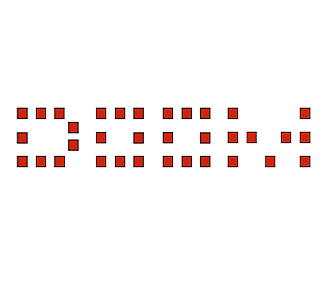

# doom-fire

<h1 align="center">
    
</h1>


## Index

- [About](#-about)
- [Technologies Used](#-tecnologies-used)
- [How to download the project](#-how-to-download-the-project)

---

## 🔖 About

A **Doom Fire** algorithm, did in Javascript, based in **Filipe Desachamps** code.

---

## 📌 Technologies Used

The project was developed using the following technologies

- [HTML5](https://developer.mozilla.org/pt-BR/docs/Web/HTML/HTML5)
- [CSS3](https://developer.mozilla.org/pt-BR/docs/Web/CSS)
- [JavaScript](https://www.javascript.com/)

---

## 📁 How to download the project

```bash

    # First clone this repository
    $ git clone https://github.com/matheuscassiano/doom-fire

    # Go into the repository
    $ cd doom-fire

    # Install the dependencies
    $ yarn install

    # Start the repository
    $ yarn start

```

---

Developed 👨‍🚀 by Matheus Cassiano


